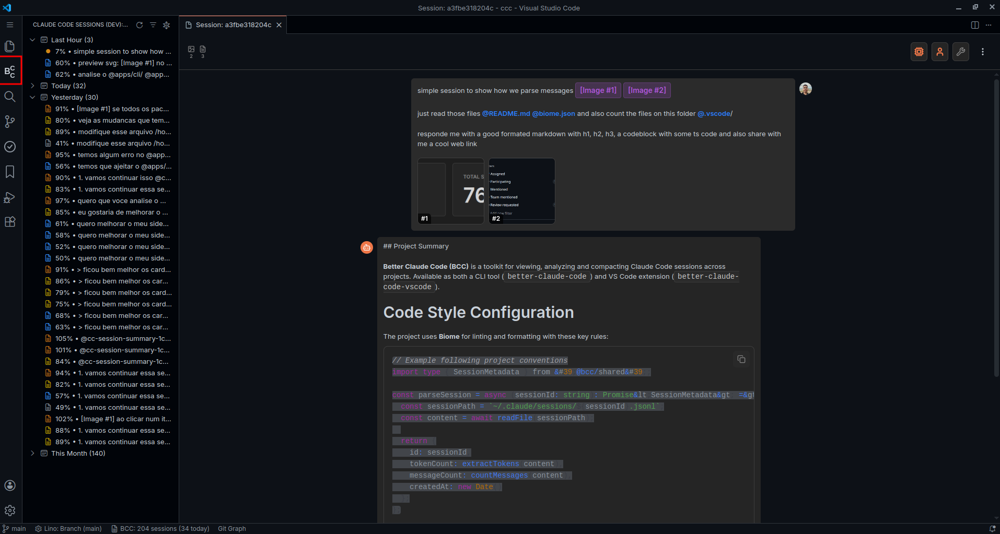

<a name="TOC"></a>

<div align="center">

<h4>Better Claude Code</h4>
<p>
  <a href="https://marketplace.visualstudio.com/items?itemName=lucasvtiradentes.better-claude-code-vscode"></a>
  <a href="https://marketplace.visualstudio.com/items?itemName=lucasvtiradentes.better-claude-code-vscode"></a>
  <a href="https://opensource.org/licenses/MIT"></a>
  <br>
  <a href="#-overview">Overview</a> • <a href="#-features">Features</a> • <a href="#-installation">Installation</a> • <a href="#-usage">Usage</a> • <a href="#-development">Development</a>
</p>

</div>

<a href="#"></a>

## 🎺 Overview

VS Code extension to browse, analyze and compact Claude Code sessions directly in your editor with real-time updates.



<a name="TOC"></a>

## ❓ Motivation<a href="#TOC"></a>

I was using Claude Code heavily for complex problems but disliked the native session compaction as it lost too much context. So I built this to run custom compaction prompts and continue work across sessions without losing track of where we were.

## ⭐ Features<a href="#TOC"></a>

- **Session Browser** - Tree view with grouping and filtering
- **Real-time Updates** - File system watching detects new sessions instantly
- **Session Compaction** - One-click AI summarization via Claude Code CLI
- **Rich Viewing** - Full conversation display with images and metadata
- **Custom Labels** - Tag sessions for organization
- **Status Bar** - Quick session stats at a glance
- **Filtering** - Filter by date, tokens, labels, and content type
- **Grouping** - Group by date, token percentage, or custom labels

## 🚀 Installation<a href="#TOC"></a>

**From VS Code Marketplace:**

1. Open VS Code
2. Go to Extensions (Ctrl/Cmd + Shift + X)
3. Search for "Better Claude Code"
4. Click Install

**From Command Line:**

```bash
code --install-extension lucasvtiradentes.better-claude-code-vscode
```

## 💡 Usage<a href="#TOC"></a>

### Getting Started

1. Open a folder/workspace in VS Code
2. Click the BCC icon in the activity bar
3. Browse sessions for the current project
4. Right-click on a session for actions

### Session Browser

Browse all Claude Code sessions from the activity bar:

- **Tree View**: Hierarchical display grouped by your preference
- **Auto-Discovery**: Automatically detects sessions from `~/.claude/sessions/`
- **Auto Expansion**: Opens "Today" and "Last Hour" groups by default

Each session displays:
- Token usage percentage (color-coded)
- Message count (user + assistant)
- Image count, file references
- Custom commands, URLs
- Compaction status (✓ badge)
- Custom labels

### Session Grouping

Organize sessions using multiple grouping modes:

- **By Date**: Last Hour, Today, Yesterday, This Week, This Month, Older
- **By Token Usage**: 0-25%, 25-50%, 50-75%, 75-90%, 90-100%
- **By Custom Labels**: User-defined project labels

Change grouping via "Filter Sessions" command.

### Session Actions

Right-click context menu provides:

- **View Conversation**: Open full session in webview panel
- **Compact Session**: Generate AI summary
- **Add Label**: Tag with custom labels
- **Open Session File**: View raw JSONL in editor
- **Copy Session Path**: Copy file path to clipboard
- **Delete Session**: Remove session with confirmation

### Conversation Viewer

Full-screen webview panel with:

- **Message Filtering**: Toggle user messages, assistant messages, tool calls
- **Image Preview**: Click to open images in modal
- **Metadata Display**: Session stats, badges, properties
- **Actions Menu**: Quick access to operations

### Session Compaction

One-click AI summarization:

1. Right-click session → "Compact Session"
2. BCC parses JSONL to markdown
3. Claude Code CLI generates summary
4. Output saved to `.bcc-compaction/{sessionId}/`
5. Summary opens automatically

Output files:
- `parsed.md` - Full conversation markdown
- `summary.md` - AI-generated summary
- `metadata.json` - Compaction metadata

### Commands

Access via Command Palette (Ctrl/Cmd + Shift + P):

- `BCC: Refresh Sessions` - Reload all sessions (F5)
- `BCC: Filter Sessions` - Change grouping mode
- `BCC: Compact Session` - Summarize session
- `BCC: Add Label` - Toggle session labels
- `BCC: Show Logs` - Open extension logs
- `BCC: Toggle Collapse/Expand` - Toggle all groups
- `BCC: View Compaction` - Open summary file

## 🔧 Development<a href="#TOC"></a>

```bash
pnpm install                     # Install dependencies
pnpm dev                         # Watch mode with hot reload
pnpm build                       # Build for production
pnpm typecheck                   # Type checking
pnpm lint                        # Linting
pnpm format                      # Code formatting
```

**Local Installation:**

```bash
pnpm build
```

This installs a development version with "-dev" suffix, keeping your marketplace version intact.

**Extension locations:**
- Official: `~/.vscode/extensions/lucasvtiradentes.better-claude-code-vscode-X.X.X`
- Development: `~/.vscode/extensions/lucasvtiradentes.better-claude-code-vscode-dev`

**Requirements:**
- VS Code 1.100.0+
- Claude Code CLI installed
- Node.js 18+

## 📜 License<a href="#TOC"></a>

MIT License - see [LICENSE](LICENSE) file for details.
