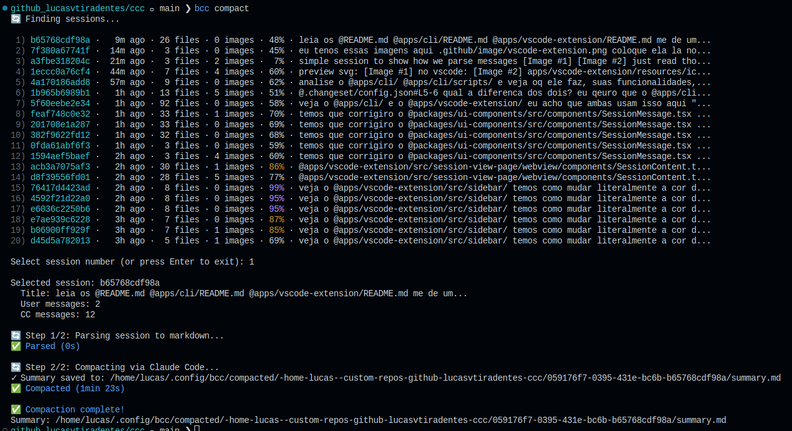
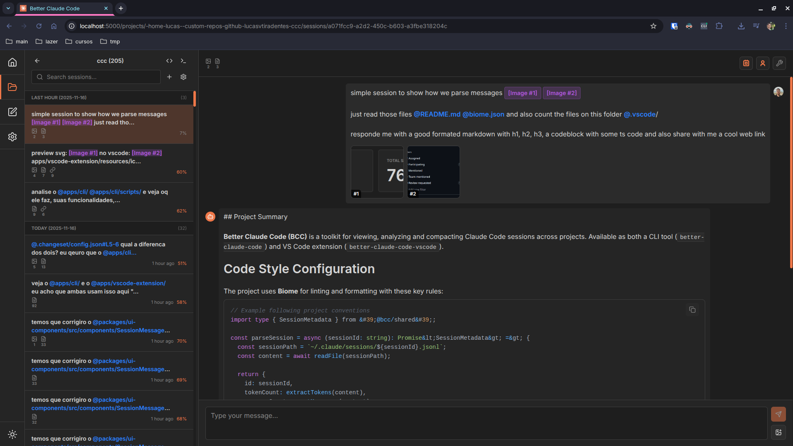

<div align="center">

<h4>Better Claude Code - CLI</h4>
<p>
  <a href="https://www.npmjs.com/package/better-claude-code"></a>
  <a href="https://www.npmjs.com/package/better-claude-code"></a>
  <a href="https://opensource.org/licenses/MIT"></a>
  <br>
  <a href="#trumpet-overview">Overview</a> • <a href="#star-features">Features</a> • <a href="#rocket-installation">Installation</a> • <a href="#bulb-usage">Usage</a> • <a href="#wrench-development">Development</a>
</p>

</div>

<a href="#"></a>

## :trumpet: Overview

CLI to manage Claude Code sessions with built-in web dashboard and AI-powered compaction.

<table>
<tr>
<th>CLI - Session Compaction</th>
<th>Web Dashboard - Session Browser</th>
</tr>
<tr>
<td width="50%"><br><sub>Interactive session selector with AI-powered summarization</sub></td>
<td width="50%"><br><sub>Browse all sessions with rich rendering, images, and filtering</sub></td>
</tr>
</table>

<a name="TOC"></a>

## :star: Features<a href="#TOC"></a>

- **Session Compaction** - Parse and summarize Claude Code sessions with AI
- **Web Dashboard** - Built-in server for session analysis
- **Shell Completion** - Tab completion for bash and zsh
- **Auto-updates** - Built-in update mechanism
- **Detached Mode** - Run web server in background
- **Interactive Selection** - User-friendly session picker

## :rocket: Installation<a href="#TOC"></a>

```bash
npm install -g better-claude-code
```

After installation, the `bcc` command will be available globally.

## :bulb: Usage<a href="#TOC"></a>

### Commands Overview

```bash
bcc --help                       # Show help
bcc compact                      # Interactively select a session to compact
bcc server --start               # Start the server
bcc update                       # Update to latest version
```

<details>
<summary><b>Server Management</b></summary>

```bash
# Start server in foreground
bcc server --start

# Start on custom port
bcc server --start --port 3000

# Start in background (detached mode)
bcc server --start --detach

# Stop background server
bcc server --stop
```

The server runs the full BCC web dashboard at `http://localhost:5000` by default.

**Web Dashboard Features:**
- Session browser with filtering and grouping
- Search by date, tokens, labels
- Project discovery with git integration
- Live Claude Code sessions
- Settings management

</details>

<details>
<summary><b>Session Compaction</b></summary>

```bash
# Interactive session selection (up to 20)
bcc compact

# Show all sessions for selection
bcc compact --all

# Auto-compact latest session
bcc compact --latest

# Compact specific session by ID
bcc compact --id abc123

# Use last Claude message as title
bcc compact --last
```

**Output:**

Generates two files in your project root:
- Parsed markdown conversation
- AI-generated summary (`cc-session-summary-{id}.md`)

**Compaction Workflow:**
1. Parse: Converts JSONL session file to readable markdown
2. Summarize: Uses Claude Code CLI to generate AI summary

</details>

<details>
<summary><b>Shell Completion</b></summary>

```bash
# Install completion for your shell (zsh or bash)
bcc completion install
```

Automatically detects your shell and installs to the appropriate location.

**Reload shell:**
```bash
source ~/.zshrc    # for zsh
source ~/.bashrc   # for bash
```

</details>

## :wrench: Development<a href="#TOC"></a>

```bash
pnpm install                     # Install dependencies
pnpm run dev                     # Run in development mode
pnpm run build                   # Build for production
pnpm run postbuild               # Bundle assets
pnpm run typecheck               # Type checking
pnpm run start                   # Run built CLI locally
```

**Build Process:**

The CLI bundles the entire backend and frontend as static assets:
1. TypeScript compilation
2. Backend + frontend bundled into `dist/`
3. Import paths fixed for distribution
4. Prompts and assets copied

This makes the CLI a self-contained executable.

## :scroll: License<a href="#TOC"></a>

MIT License - see [LICENSE](../../LICENSE) file for details.
